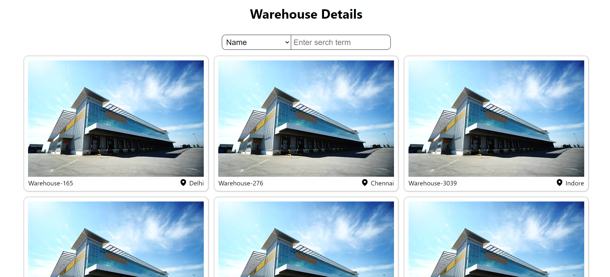
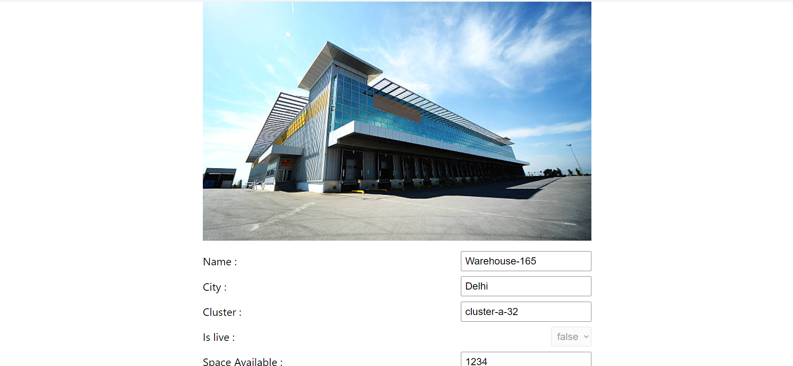
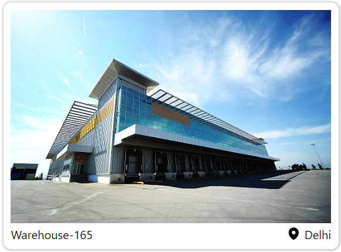

# Warehouse Management System

## Overview

A React.js application for managing warehouses efficiently. Users can search for warehouses, filter them based on various criteria, and view detailed information about each warehouse. The application also provides an edit functionality to update warehouse details.

## Features 

- Search warehouses by name

- Filter warehouses based on:

    - City
    - Cluster
    - Space available limit

- View detailed information about each warehouse

- Edit warehouse details:

    - Cluster
    - Warehouse name
    - City
    - Space available
    - Warehouse live status

## TechStack

- React.js
- React Router DOM for navigation

## Getting started

1) Clone repository

```bash
git clone https://github.com/Jinu-Vijayan/warehouse_details.git
```

2) Install dependencies

```bash
cd ./warehouse_details
npm install
```
2) Start the development server:

```bash
npm start
```

The application will be available at `http://localhost:3000`.

## Future enhancements

### Adding Warehouse Details

The ability for users to add and update details for specific warehouses will be a valuable enhancement. This could include features like:

- Uploading photos and documents related to the warehouse

- Entering contact information for key personnel

- Logging maintenance and repair history

- Tracking certifications and compliance requirements

- Storing information about warehouse layout and equipment

## Pages

### Home page



### Details Page



## Components

### Warehouse card



## Contributing

Contributions are welcome! If you find any issues or have suggestions for improvements, please create a new issue or submit a pull request.